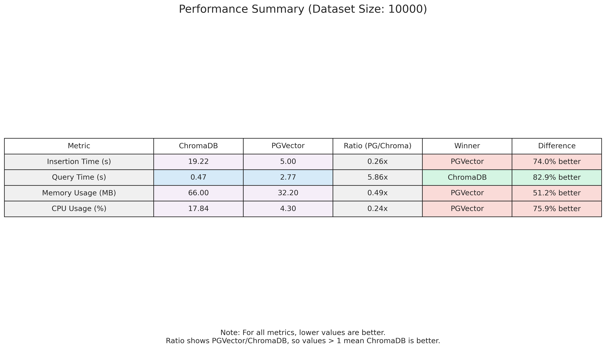

# ChromaDB vs PGVector Benchmark Suite

This repository contains a comprehensive benchmark suite for comparing ChromaDB and PGVector performance across various scenarios. The benchmarks measure:

1. Insertion performance
2. Query performance (similarity search)
3. Memory usage
4. CPU usage

## Performance Summary

The following table summarizes the performance comparison between ChromaDB and PGVector:



## Prerequisites

- Docker
- Python 3.12+

## Setup

1. Install the required Python packages:
```bash
pip install -r requirements.txt
```

2. Start PostgreSQL with pgvector:
```bash
docker run -it --rm --name postgres -p 5433:5432 \
   -e POSTGRES_USER=admin \
   -e POSTGRES_PASSWORD=admin123 \
   -e POSTGRES_DB=mydatabase \
   pgvector/pgvector:pg17
```

3. Start ChromaDB:
```bash
# Run ChromaDB container
docker run -it --rm --name chroma -p 8009:8000 chromadb/chroma
```

4. Wait a few seconds for the databases to initialize.

## Running the Benchmarks

To run all benchmarks:
```bash
python benchmark.py
```

This will:
- Run all benchmark scenarios
- Save raw results as CSV files in the `benchmark_results` directory
- Generate charts in the `benchmark_results/charts` directory

To analyze the results and generate additional visualizations:
```bash
python analyze_results.py
```

## Benchmark Methodology

The benchmark uses the following methodology:

1. **Test Data**: The 20 newsgroups dataset is used with embeddings generated using the 'all-MiniLM-L6-v2' model.
2. **Dataset Sizes**: Tests are run with different dataset sizes: 100, 1000, and 10000 documents.
3. **Metrics**:
   - **Insertion Time**: Time taken to insert documents into the database
   - **Query Time**: Time taken to perform similarity searches
   - **Memory Usage**: Memory consumption during operations
   - **CPU Usage**: CPU utilization during operations
4. **Consistency**: Both databases are accessed through LangChain's interface for consistent comparison.

## Results

The benchmark results are saved in the following formats:

1. Raw CSV files in `benchmark_results/`:
   - `insertion_benchmark.csv`
   - `query_benchmark.csv`
   - `memory_usage_benchmark.csv`
   - `cpu_usage_benchmark.csv`

2. Summary report:
   - `benchmark_results/summary_report.csv`
   - `benchmark_results/recommendations.csv`

3. Visualization charts in `benchmark_results/charts/`:
   - `summary_table.png`: Overall performance comparison
   - `performance_comparison.png`: Detailed performance metrics
   - `scaling_analysis.png`: How each database scales with dataset size
   - `radar_comparison.png`: Radar chart showing relative strengths
   - `performance_ratio.png`: Direct ratio comparison between databases

## Cleanup

To stop and remove the database containers:
```bash
# Stop and remove PostgreSQL container
docker stop my-postgres-db
docker rm my-postgres-db

# Stop and remove ChromaDB container
docker stop $(docker ps -q --filter ancestor=chromadb/chroma)
docker rm $(docker ps -a -q --filter ancestor=chromadb/chroma)

# Remove data volume (optional)
rm -rf ./chroma-data
```

## References

- ChromaDB: [https://docs.trychroma.com/guides/deploy/docker](https://docs.trychroma.com/guides/deploy/docker)
- PGVector: [https://github.com/pgvector/pgvector](https://github.com/pgvector/pgvector)
